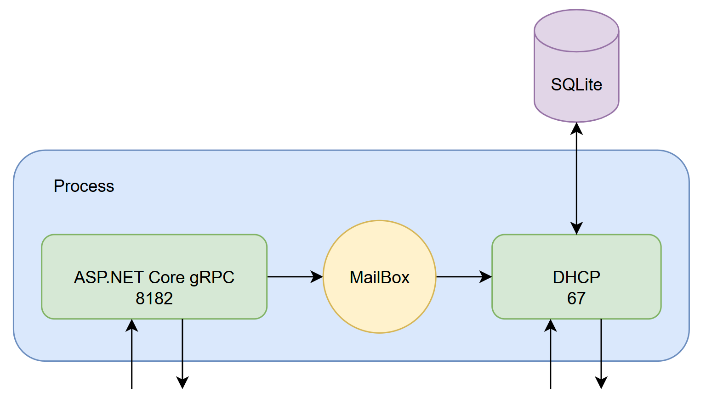

  

<h1 align="center">
  Meerkat DHCP Server
</h1>

Meerkat is a simple IPv4 DHCP server with gRPC management endpoints. Since it is designed to be used in a private home network, there is no TLS and encryption, the whole process is protected with a secret, same as your home modem/router. I created this after reading the following specifications:

- [RFC 951: BOOTSTRAP PROTOCOL](https://datatracker.ietf.org/doc/html/rfc951) 
- [RFC 1542: Clarifications and Extensions for the Bootstrap Protocol](https://datatracker.ietf.org/doc/html/rfc951) 
- [RFC 2131: Dynamic Host Configuration Protocol](https://datatracker.ietf.org/doc/html/rfc951) 
- [RFC 2132: DHCP Options and BOOTP Vendor Extensions](https://datatracker.ietf.org/doc/html/rfc951) 

There are more DHCP related specifications that I haven't read them and they are not used in this software.

### Architecture

On startup a gRPC server will start on the default port of 8182 and accepts management commands, such as starting and stopping the DHCP server. For command processing a MailBox is used. For database, EF Core with SQLite is used. gRPC contracts are code-first using protobuf-net library.

### Implementation Details

Different scopes are supported which can be reached by clients in different networks using boot relay agents. For each scope, address reservation based on hardware address is supported.

The values of `htype` and `hlen` fields must be 1 and 6 otherwise the request will not be processed.

All DHCP message types are supported. Offered addresses will be reserved for one minute. A database cleaner job will remove the unacknowledged and released leases that are more than one minute old. Declined addresses will not be cleaned and will not be reused, because according to specification, it means the address is already in use by some client.

Options 1, 3, 6, 51, 53 and 54 are implemented. Client's IP and lease time suggestions will be ignored. Up to two DNS addresses can be set for each scope.

DHCP listener will put the messages in a queue for workers to process them. By default four workers will be created at startup.

Multiple instances of this server can coexist in the same network as long as each one has its own database (ideally they should have their own scopes too).

### Your Feedback Is Appreciated

It's unlikely that this software will be used by anyone and the main purpose of this project was for me to practice socket programming and to serve as a portfolio. For this reason this software was not thoroughly tested and currently there is no gRPC client manager app for it (a simple starter app is available to start the server), also not all management features are exposed or implemented. Your feedback and bug reports are appreciated and will motivate me to improve this software.